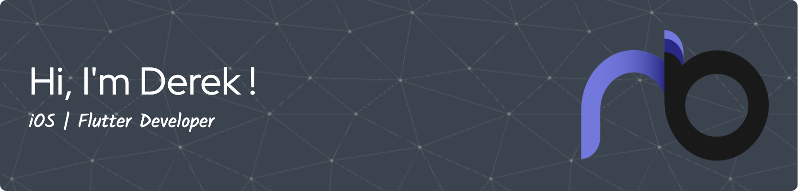

- 👋 Hi, I’m Derek!
- 👀 I am a Mobile App Developer.
- 🌱 I specialize in Flutter/Dart/Swift(UIKit)/SwiftUI.
- 💞️ I’m looking for employment as an iOS or Flutter Developer!
- 📫 How to reach me: dk@derek.kim

# Blog posts

<!-- BLOG-POST-LIST:START -->
- [Validate Credit Card Number — Luhn’s Check Algorithm Explained in Swift](https://derekhskim.medium.com/validate-credit-card-number-luhns-check-algorithm-explained-in-swift-d25235a2415b?source=rss-5573399ce9ee------2)
- [[LeetCode in Swift] Container With Most Water](https://derekhskim.medium.com/leetcode-in-swift-container-with-most-water-bea0c6a28edf?source=rss-5573399ce9ee------2)
- [[LeetCode in Swift] Best Time to Buy and Sell Stock](https://derekhskim.medium.com/leetcode-in-swift-best-time-to-buy-and-sell-stock-a3cc6ccfaa9c?source=rss-5573399ce9ee------2)
- [[LeetCode in Swift] Best Time to Buy and Sell Stock II](https://derekhskim.medium.com/leetcode-in-swift-best-time-to-buy-and-sell-stock-ii-d446d030869f?source=rss-5573399ce9ee------2)
<!-- BLOG-POST-LIST:END -->

<h3 align="left">Connect with me:</h3>

<h3 align="left">Languages and Tools:</h3>

 

